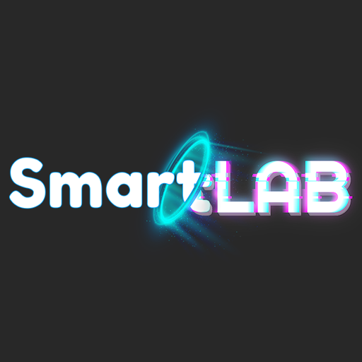

# [SmartLAB LAboratory](https://smartlab.com.co/) - Porfolio

This is an open source code propirty of Laboratorio SmartLAB, web apps service briefcase build whit [Tailwind CSS](https://tailwindcss.com/) and[ NextJS](nextjs.org/) coded and design by [Steevens](https://www.linkedin.com/in/steevens-rodriguez-876691174/).

## Getting Started

Choose one of the following options to get started:

- [Download the latest release](https://github.com/esviren/SmartVerso-Next-Dapp/archive/main.zip)
- Clone the repo: `git clone https://github.com/esviren/SmartVerso-Next-Dapp.git`
- Fork the repo

## About the Template

- Template building using NextJS Version 10
- Tailwind v2.0

## Feature Template

- Using [NextJS Image](https://nextjs.org/docs/api-reference/next/image) for Image Optimization
- Slider using [React Slick](https://react-slick.neostack.com/docs/api)
- Smooth Scrolling and Active menu using [React Scroll](https://www.npmjs.com/package/react-scroll)

## Bugs and Issues

Have a bug or an issue with this template? [Open a new issue](https://github.com/esviren/SmartVerso-Next-Dapp/issues/new) here on GitHub.

## Creator

[SmartLAB Laboratory](https://smartlab.com.co/) was coded and modified by and is maintained by **[me](https://github.com/esviren/)**, and dekstop design by [Steevens Rodriguez](https://www.linkedin.com/in/steevens-rodriguez-876691174/)

## Copyright and License

Code released under the MIT license.

## To Do List Add Feature

- [ ] Animation using Framer Motion
